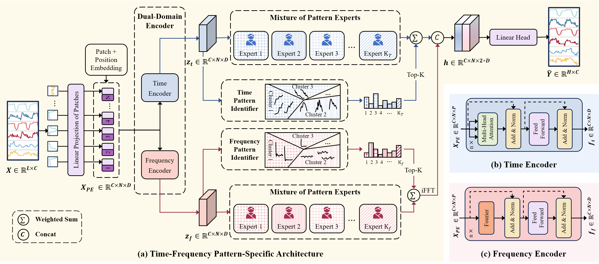

# Learning Pattern-Specific Experts for Time Series Forecasting Under Patch-level Distribution Shift


## :sparkles: Abstract


Time series forecasting, which aims to predict future values based on historical data, has garnered significant attention due to its broad range of applications. 
However, real-world time series often exhibit complex non-uniform distribution with varying patterns across segments, such as season, operating condition, or semantic meaning, making accurate forecasting challenging.
Existing approaches, which typically train a single model to capture all these diverse patterns, often struggle with the pattern drifts between patches and may lead to poor generalization.
To address these challenges, we propose **TFPS**, a novel architecture that leverages pattern-specific experts for more accurate and adaptable time series forecasting. TFPS employs a dual-domain encoder to capture both time-domain and frequency-domain features, enabling a more comprehensive understanding of temporal dynamics. It then uses subspace clustering to dynamically identify distinct patterns across data patches. Finally, pattern-specific experts model these unique patterns, delivering tailored predictions for each patch. By explicitly learning and adapting to evolving patterns, TFPS achieves significantly improved forecasting accuracy. Extensive experiments on real-world datasets demonstrate that TFPS outperforms state-of-the-art methods, particularly in long-term forecasting, through its dynamic and pattern-aware learning approach.

## :sparkles: Datasets
You can obtain all the benchmarks from Google Drive (https://drive.google.com/drive/folders/1LrnL3nNNOcrQX2vk2abKahdkw4NGBxbG). All the datasets are well pre-processed and can be used easily.

## :sparkles: How to Run the Code:

1. Install Python 3.6, PyTorch 1.9.0.
2. Install requirements. pip install -r requirements.txt
3. Train the model. We provide the experiment scripts of all benchmarks under the folder ./scripts. Now you can reproduce the experiment results by:

```javascript
sh ./scripts/ETTh1.sh
```

## :sparkling_heart: Acknowledgements

The codes in this repository are inspired by the following:

- PatchTST: https://github.com/yuqinie98/PatchTST
- FNet: https://github.com/google-research/google-research/tree/master/f_net
